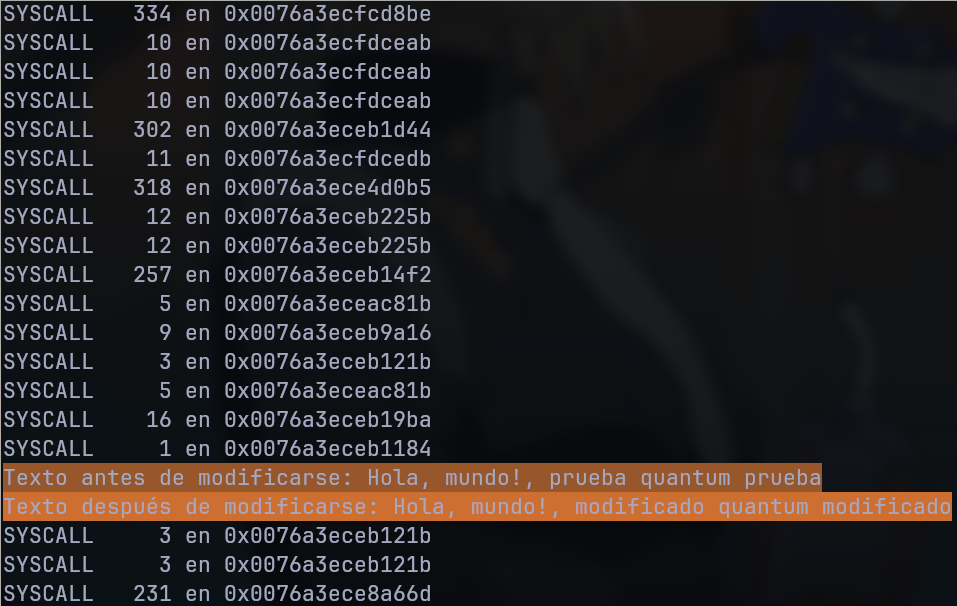

Programa que usa ```ptrace``` para interceptar la syscall "sys_write" de un proceso hijo para modificar sus argumentos

EL proceso ejecuta:
```c
execl("/bin/echo", "/bin/echo", "Hola,", "mundo!,", "prueba", "quantum", "prueba", NULL);
```
EL texto a remplazar y de remplazo se defineen ```#define TEXTO_A_REEMPLAZAR "prueba"``` y ```#define TEXTO_DE_REEMPLAZO "modificado"```

#### Ejemplo


